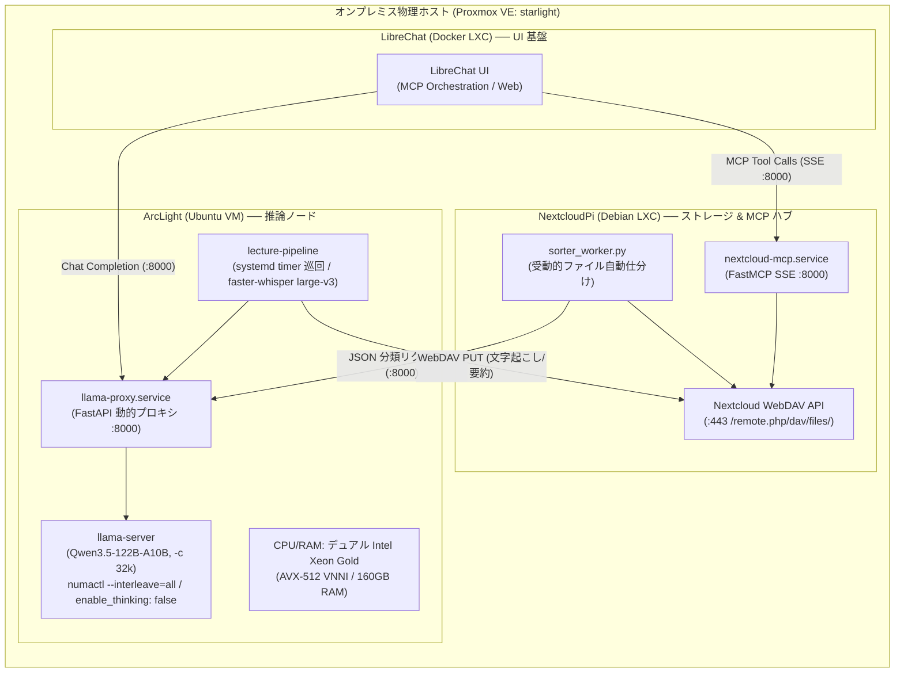

# mcp-file-agent

オンプレミス仮想化基盤（Proxmox VE）上で稼働する Nextcloud を中核とし、ローカル LLM（`llama.cpp`）および LibreChat の Model Context Protocol (MCP) を統合した、学術データ自律仕分け・音声文字起こし・講義ノート生成インフラです。

---

## 1. システム概要 (Overview)

本リポジトリは、以下の2つの自律パイプラインを密結合して運用するための統合バックエンドです。

1. **Nextcloud FastMCP Agent (閲覧・検索・仕分け基盤):**
   * LibreChat の MCP クライアント機能から、WebDAV 経由で安全に Nextcloud 上の学術資料や講義ノートを横断検索・参照する FastMCP (SSE) サーバー。
   * アップロードされた資料のファイル名から科目・回数をローカル LLM（Qwen 122B）が自律推論し、該当ディレクトリへ自動分類・移動する受動的ワーカー。
2. **講義音声 文字起こし & 構造化要約パイプライン (推論バッチ基盤):**
   * スマホから Nextcloud の受信トレイ（`00_Inbox`）へ投入された音声ファイルを検知。
   * オンプレミスの Xeon 計算基盤（Cascade Lake Dual / 160GB RAM）上で CPU 推論（`faster-whisper` + `llama.cpp`）を実行し、文字起こし全文と試験対策用 Markdown 講義ノートを自律生成して Nextcloud へ再配置。

---

## 2. システムアーキテクチャ (Architecture)

物理ホスト（Proxmox VE）内の VM / LXC コンテナ間を Tailscale メッシュネットワークで結び、宅内 LAN の IP 変動や瞬断に影響されない閉域通信を確立しています。



---

## 3. 主要コンポーネント (Components)

### ① FastMCP サーバー (`src/mcp_server.py`)
* **プロトコル:** Model Context Protocol (FastMCP 1.x 準拠, SSE トランスポート)。
* **セキュリティ:** 意図しないファイル破壊やシステム領域参照を防ぐため、閲覧専用ツールに限定し、相対パス検証によるパストラバーサル防止ガードを実装。
  * `list_course_notes(subpath)`: 科目・回数ごとのフォルダやノート一覧を取得。
  * `read_course_note(relative_file_path)`: 講義ノート要約や文字起こしテキストの読み出し。

### ② 受動的自動仕分けワーカー (`src/sorter_worker.py`)
* **推論制御:** `_Inbox` に配置された未整理ファイルをスキャンし、ローカル LLM（ArcLight ポート 8000 の `llama-proxy`）へ問い合わせ。
* **思考抑制 & 堅牢化:** `chat_template_kwargs: {"enable_thinking": False}` により Reasoning ループを抑止し、`response_format={"type": "json_object"}` で曖昧なファイル名から科目名と講義回（第XX回）を高精度に抽出。万が一の `<think>` タグ混入時にも自動パース除去ガードを実装。
* **WebDAV 移動:** Nextcloud のデータベース整合性を保護するため、直接のファイルシステム操作を避け、公式 WebDAV `MKCOL` / `MOVE` API 経由で移動を実行。

### ③ 講義音声 文字起こし & 要約パイプライン (`src/pipeline.py`)
* **音声前処理:** スマホ録音時の ADTS パケット破損を吸収するため、`ffmpeg` により `16kHz mono WAV` へ事前サニタイズ変換。
* **高速文字起こし:** Cascade Lake の `AVX-512 VNNI`（INT8 積和演算）および `beam_size=1`（Greedy 探索）を駆使し、CPU 実行でありながら RTF（リアルタイム係数）約 0.28 を達成。
* **超高精度要約:** 超巨大 MoE モデル `Qwen3.5-122B-A10B` を採用。思考タグを無効化することで即座に構造化ノートを生成。32k コンテキストにより長時間の講義全文を一撃で処理可能。
* **先行保存ガード:** LLM 要約時のタイムアウトや推論エラーに備え、Whisper 完了直後に文字起こし全文を Nextcloud へ即座に `PUT` アップロードするフェイルセーフを確立。
* **排他巡回:** `lecture-pipeline.timer` に `OnUnitInactiveSec=5min` を設定し、多重起動によるメモリ・CPU バウンドのパンクを物理的に遮断。

### ④ 共通 WebDAV 通信クライアント (`src/nc_client.py`)
* `requests` ベースの軽量 WebDAV ラッパーモジュール。
* HTTP `Destination` ヘッダー転送における latin-1 制限を回避するため、日本語ファイルパスを `quote(path, safe="/")` で自動エンコード処理。

---

## 4. ドキュメント & 詳細設計 (Documentation)

各サブシステムの設計思想、トラブルシューティング記録、最適化ベンチマークは `docs/` 配下にまとめています。

* **[講義音声 自動文字起こし & 構造化要約パイプライン仕様書](docs/lecture-pipeline.md)**  
  ステートマシン設計、生 AAC 破損対策、PyAV バージョン互換性、AVX-512 VNNI チューニング、systemd timer 排他制御。
* **[Nextcloud MCP & 自動仕分け連携仕様書](docs/nextcloud-mcp.md)**  
  FastMCP SSE 設定、LibreChat SSRF 対策、WebDAV メタデータ保護、分類プロンプト設計。
* **[自宅インフラ & ネットワーク構成仕様書](docs/infrastructure.md)**  
  Proxmox VE 仮想化トポロジ、Tailscale MagicDNS 固定、デュアル Xeon NUMA 最適化（`numactl --interleave=all`）、`llama-proxy` 思考抑制アーキテクチャ。

---

## 5. セットアップ (Getting Started)

### 1. 依存ライブラリのインストール
```bash
pip install -r requirements.txt
```

### 2. 環境変数の設定
各スクリプトは環境変数経由で接続情報を読み込みます（未指定時はデフォルト値を使用）。

```bash
export NC_HOST="[https://your-nextcloud.ts.net](https://your-nextcloud.ts.net)"
export NC_USER="your_nextcloud_username"
export NC_PASS="your_nextcloud_app_password"
export LLM_HOST="http://your-arclight-ip:8000"
export LLM_MODEL="Qwen_Qwen3.5-122B-A10B-Q4_K_M-00001-of-00002.gguf"
export TARGET_ROOT="/大学/2026